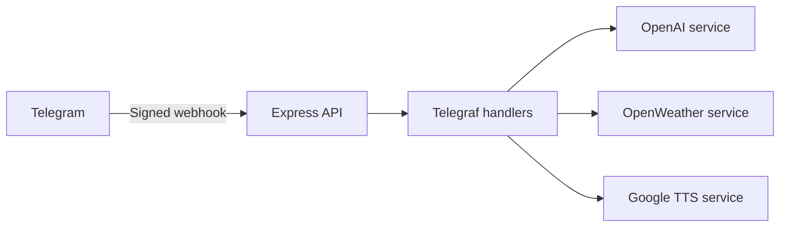

# Telegram AI Bot

A secure webhook-based Telegram bot that combines conversational AI, weather data and text-to-speech using Node.js and Express.

> **Security notice:** credentials must be provided through environment variables and any previously exposed credential must be rotated before deployment. No credential value is included in this repository.

## Features

- Conversational responses powered by OpenAI
- Short story generation through `/historia`
- Weather lookup and location through `/tiempo`
- Text-to-speech audio as a progressive enhancement
- `/test` command for a lightweight bot check
- Authenticated Telegram webhook and isolated `/health` endpoint
- Input validation, normalized provider errors and privacy-conscious logging

## Architecture



The application keeps HTTP concerns, Telegram handlers, provider integrations, configuration and validation in small dedicated modules. External providers are mocked in the automated test suite.

## Tech stack

Node.js · Express · Telegraf · OpenAI API · OpenWeather API · Google Translate TTS · Axios · node:test

## Commands

- `/test` — confirms that the bot can reply.
- `/tiempo <city>` — returns current weather details and a map location.
- `/historia <characters>` — generates a short text-only story.
- Any other text message — returns an AI response and, when available, an audio version.

## Environment variables

Copy `.env.example` to `.env` and provide your own credentials. The application validates required variables at startup and reports only the missing variable name. Never commit `.env` files.

## Local development

```bash
npm install
npm run dev
```

Telegram requires a publicly reachable HTTPS webhook URL. Registration occurs at startup using the configured secret token.

## Quality checks

```bash
npm run check
npm test
npm audit
```

Tests use Node's built-in test runner and make no real requests to Telegram, OpenAI, OpenWeather or Google Translate TTS.

## HTTP endpoints

- `GET /health` returns only `{ "status": "ok" }`.
- `POST /telegram-bot` accepts valid Telegram updates with the configured secret header.

## Security and privacy

- Webhook requests require `X-Telegram-Bot-Api-Secret-Token`.
- Request bodies, chat content, usernames, prompts, responses and credentials are not logged.
- JSON payload size is limited and invalid updates are rejected.
- Provider errors are converted into safe user-facing messages.
- Secrets are loaded exclusively from environment variables.

This repository was created from a sanitized source tree with a new Git history. It does not include credentials, private conversations or the history of its private source repository.

## Status

Public reference implementation. The repository documents local setup and webhook requirements but does not claim an active production deployment.
